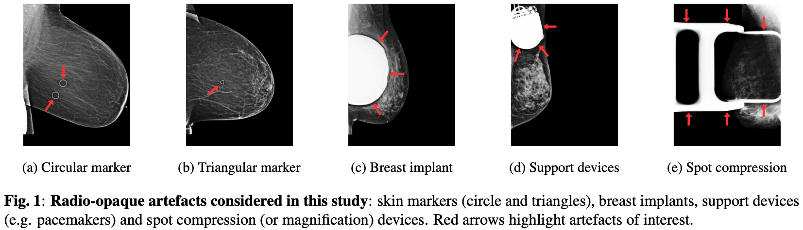

# Detection and effect of artifacts in breast mammography

This repository contains the code associated with the paper [Radio-opaque artefacts in digital mammography: Automatic detection and analysis of downstream effects](https://arxiv.org/abs/2410.03809v1), presented at ISBI 2025.

 

It contains the following files:
* `labelling_tools` contains the notebook with the lightweight artifact labelling tool
* `artifact_detector_model.py` contains the model definition for the multi-label artifact detector
* `artifact_train.py` contains the code to train the detector
* `artifact_evaluation.ipynb` contains the evaluation code/plotting for the detector
* `downstream_model.py` contains the model definition for the downstream evaluation tasks (lesion detection and density prediction)
* `cancer_train.py` to train the screening outcome / lesion detection prediction model
* `density_train.py` to train the density classification model
* `dataset.py` defines dataset classes and pytorch lightining data modules for all training tasks. 

Paper reference:
```
@inproceedings{schueppert2025radio,
  title={Radio-opaque artefacts in digital mammography: automatic detection and analysis of downstream effects},
  author={Schueppert, Amelia and Glocker, Ben and Roschewitz, M{\'e}lanie},
  booktitle={2025 IEEE 22nd International Symposium on Biomedical Imaging (ISBI)},
  pages={1--5},
  year={2025},
  organization={IEEE}
}
```

## Artifact datasets
The manually labelled artifact dataset file can be found in `labelling_tools/manual_annotations_new.csv`. 
The model predictions from the artefact detector for all images in EMBED can be found in `predicted_all_embed.csv`

## Requirements
All required pip depencies needed to run code in this project are listed in `requirements.txt`

## Train the artifact detector
Simply run `python train_detector.py` to train your own artefact detector.

## Train the downstream model (e.g. density)
Simply run `python density_train.py` to train a density classification model.

To assess the model per artifact you can then run inference: `python density_inference.py` and analyse outputs with `density_evaluate_markers.ipynb`
